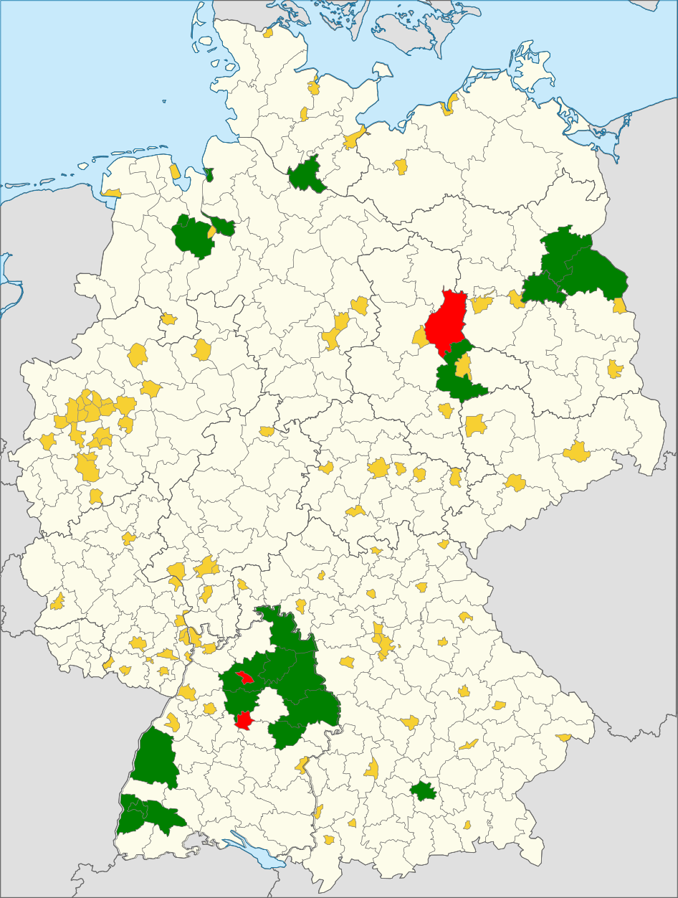

# NextTrash

Ein kleines Kommandozeilen-Tool, das schnell die nächsten Abfuhrtermine anzeigt - nützlich als permanenter Reminder.

Das Tool zieht sich die Daten aus den ICS-Dateien, die viele Abfallwirtschaftsunternehmen auf ihren Webseiten anbieten.

# Getestete Abfallbetriebe

Funktioniert mit 

| Entsorgungsbetrieb     | Link     | Config-Kürzel     |
|:-----------------------|:---------|:------------------|
| ABH Havelland | [ICS-Generator](https://www.abfall-havelland.de/index.php?page_id=543#) | ABH_Havelland|
| APM Niemegk // Landkreis Potsdam-Mittelmark | [ICS-Generator](https://www.apm-niemegk.de/tourenplan-2020-ph) | APM_Niemegk|
| ASF Freiburg | [ICS-Generator](https://www.abfallwirtschaft-freiburg.de/de/private_haushalte/abfuhrtermine.php) | ASF_Freiburg |
| ASG Wesel | [ICS-Generator](https://www.asg-wesel.de/Abfallkalender_55623.html) | ASG_Wesel |
| AVL Ludwigsburg | [ICS-Download](https://www.avl-ludwigsburg.de/privatkunden/termine/abfallkalender/) | AVL_Ludwigsburg|
| AVR Rhein-Neckar-Kreis | [ICS-Generator](https://www.avr-kommunal.de/online-service/abfallkalender/) | AVR_Rhein_Neckar_Kreis | 
| AWB Landkreis Göppingen | [ICS-Generator](https://www.awb-gp.de/termine/abfuhrtermine/) | AWB_Landkreis_Goeppingen|
| AWB Landkreis Karlsruhe| [ICS-Generator](https://www.awb-landkreis-karlsruhe.de/WasteManagementKarlsruheHaushalte/WasteManagementServlet?SubmitAction=wasteDisposalServices)|ABW_Landkreis_Karlsruhe|
| AWG Bassum | [ICS-Generator](https://www.awg-bassum.de/abfuhrkalender.html) | AWG_Bassum|
| AWM München | [ICS-Generator](https://www.awm-muenchen.de/index/abfuhrkalender.html) | AWM_Muenchen|
| AWN Neckar-Odenwald-Kreis| [ICS-Download](https://www.awn-online.de/haushalte/abfuhrtermine) | AWN_Neckar_Odenwald_Kreis |
| Abfallwirtschaft Breisgau-Hochschwarzwald | [ICS-Download](https://www.breisgau-hochschwarzwald.de/pb/Breisgau-Hochschwarzwald/Start/Service+_+Verwaltung/Abfallwirtschaft.html) | Landkreis_Breisgau_Hochschwarzwald |
| Abfallwirtschaft Hohenlohekreis | [ICS-Generator](https://www.abfallwirtschaft-hohenlohekreis.de/infos-beratung/termine-leerungen) | Abfallwirtschaft_Hohenlohekreis |
| Abfallwirtschaft Ortenaukreis | [ICS-Generator](https://www.abfallwirtschaft-ortenaukreis.de/abfallkalender-abfuhrtermine/abfuhrkalender-strauchgut-und-sperrmuelltermine-2020/) | Abfallwirtschaft_Ortenaukreis |
| Abfallwirtschaft Rems-Murr | [ICS-Generator](https://www.abfallwirtschaft-rems-murr.de/generator/abfallkalender_2017.php) | Abfallwirtschaft_Rems_Murr |
| Abfallwirtschaft Vorpommern-Rügen | [ICS-Generator](https://www.lk-vr.de/Kreisverwaltung/Abfallwirtschaft/Abfuhrtermine/) | Abfallwirtschaft_Vorpommern_Ruegen|
| Aha Zweckverband Abfallwirtschaft Region Hannover | [ICS-Generator](https://www.aha-region.de/abholtermine/abfuhrkalender/?L=0) (liefert eine Datei per Abfallart. Bitte Inhalte in eine ICS-Datei zusammenkopieren) | aha_Region_Hannover |
| BSR Berlin | [ICS-Generator](https://www.bsr.de/abfuhrkalender-20520.php) | BSR_Berlin|
| Barnimer Dienstleistungsgesellschaft | [ICS-Generator](https://www.kw-bdg-barnim.de/service/abfuhrtermine/entsorgungstermine.html) | Barnimer_Dienstleistungsgesellschaft|
| Bremer Stadtreinigung | [ICS-Generator](https://www.die-bremer-stadtreinigung.de/privatkunden/entsorgung/ihr_bremer_abfallkalender-23080) | Bremer_Stadtreinigung|
| EBU Ulm | [ICS-Generator](https://www.ebu-ulm.de/abfall/abfuhrtermine.php)|EBU_Ulm|
| EVA Abfallentsorgung | [ICS-Generator](https://www.eva-abfallentsorgung.de/abfuhrkalender/afktools.php?action=build_calendar) | EVA_Abfallentsorgung | 
| Entsorgungsbetrieb Märkisch-Oderland | [ICS-Generator](https://www.entsorgungsbetrieb-mol.de/de/tourenplan-20192020.html) | Entsorgungsbetrieb_Maerkisch_Oderland|
| Entsorgungsbetriebe Konstanz| [ICS-Generator](https://www.konstanz.de/entsorgungsbetriebe/abfuhrtermine/online-abfuhrkalender)|Entsorgungsbetriebe_Konstanz|
| Entsorgungsgesellschaft Görlitz-Löbau-Zittau mbH | [ICS-Generator](https://www.abfall-eglz.de/abfallkalender.0.html) | Entsorgungsgesellschaft_Görlitz_Löbau_Zittau|
| Entsorgungsgesellschaft Steinfurt | [ICS-Generator](https://www.egst.de/de/abfallabholung/) | ESTG_Kreis_Steinfurt |
| FES Frankfurt / Main | [ICS-Generator](https://www.fes-frankfurt.de/leistungen/abfallkalender/) | FES_Frankfurt|
| GOA Ostalbkreis | [ICS-Generator](https://www.goa-online.de/privat/abfuhrkalender/) | GOA_Ostalbkreis|
| KWU Entsorgung Oder-Spree | [ICS-Generator](https://www.kwu-entsorgung.de/?page_id=337) | KWU_Oder_Spree |
| Kommunaler Abfallentsorgungsverband Niederlausitz | [ICS-Generator](https://www.kaev.de/Info-und-Service/Tourenplan/Tourenplan-Abfalltermine.html) | KAV_Niederlausitz | 
| Landkreis Böblingen | [ICS-Generator](https://www.lrabb.de/,Lde/start/Service+_+Verwaltung/Abfuhrtermine.html)|Landkreis_Boeblingen|
| Landkreis Garmisch-Partenkirchen | [ICS-Download](https://abfuhrkalender.lkr-gap.de/webapps/WasteManagementGarmisch/WasteManagementServlet) | Landkreis_Garmisch_Partenkirchen |
| Landkreis Heilbronn | [ICS-Generator](http://www.landkreis-heilbronn.de/abfallkalender.7005.htm) | Landkreis_Heilbronn|
| Landkreis Ludwigslust-Parchim | [ICS-Generator](https://www.kreis-lup.de/leben-im-landkreis/verkehr-ordnung-sicherheit/abfallwirtschaft/abfallkalender/) | Landkreis_Ludwigslust_Parchim|
| Landkreis Mecklenburgische Seenplatte | [ICS-Generator](https://www.lk-mecklenburgische-seenplatte.de/Angebote/Abfall-Müll/Abfuhrkalender-2020/index.php) | Landkreis_Mecklenburgische_Seenplatte|
| Landkreis Nordwestmecklenburg | [ICS-Generator](https://www.nordwestmecklenburg.de/de/abfuhrtermine-nwm.html) | Landkreis_Nordwestmecklenburg|
| Landkreis Oldenburg | [ICS-Generator](https://www.oldenburg-kreis.de/portal/seiten/abfallkalender-online-900000291-21700.html) | Landkreis_Oldenburg|
| Landkreis Ostprignitz-Ruppin | [ICS-Generator](https://www.ostprignitz-ruppin.de/index.phtml?ort=353.173&strasse=353.142.1&vtyp=4&vJ=2020&call=sfm&La=1&css=&bn=&Barriere=&sNavID=353.90&ffmod=abf&ffsm=1)| Landkreis_Ostprignitz_Ruppin | 
| Landkreis Prignitz | [ICS-Generator](https://www.landkreis-prignitz.de/de/wirtschaft/Abfallkalender_neu/abfallkalender.php) | Landkreis_Prignitz |
| Landkreis Rostock | [ICS-Generator](https://www.abfall-lro.de/de/abfuhrtermine/index.php/) |Landkreis_Rostock |
| Landkreis Schwäbisch Hall | [ICS-Generator](https://www.lrasha.de/de/buergerservice/abfallwirtschaft/abfallkalender) | Landkreis_Schwaebisch_Hall|
| Landkreis Wittenberg | [ICS-Generator](https://www.landkreis-wittenberg.de/de/abfallkalender-online.html) | Landkreis_Wittenberg |
| Main-Tauber-Kreis | [ICS-Generator](https://www.main-tauber-kreis.de/Landratsamt/Service/Abfallwirtschaft/Abfallkalender) | Main_Tauber_Kreis|
| RSAG Rhein-Sieg-Kreis | [ICS-Generator](https://www.rsag.de/abfallkalender/abfuhrtermine)| RSAG |
| Stadt Heidelberg | [ICS-Generator](https://www.gipsprojekt.de/featureGips/Gips?Anwendung=Abfuhrkalender&Mandant=Heidelberg&Abfuhrkalender=Heidelberg) | Stadt_Heidelberg |
| Stadt Mannheim | [ICS-Generator](https://www.mannheim.de/de/service-bieten/umwelt/sauberkeit-und-abfall/abfallwirtschaft/abfallkalender/abfallkalender-online)|Stadt_Mannheim|
| Stadt Oldenburg | [ICS-Generator](https://services.oldenburg.de/index.php?id=45&tx_citkoabfall_abfallkalender[action]=formSimple&tx_citkoabfall_abfallkalender[controller]=Frontend&cHash=6d14b5e4e24d4c9e4dc936e938c81581) | Stadt_Oldenburg|
| Stadtentsorgung Rostock | [ICS-Generator](https://www.stadtentsorgung-rostock.de/service/ekalend/1216) |Stadtentsorgung_Rostock |
| Stadtreinigung Hamburg | [ICS-Generator](https://www.stadtreinigung.hamburg/privatkunden/abfuhrkalender/index.html) | Stadtreinigung_Hamburg|
| Stadtwirtschaftliche Dienstleistungen Schwerin | [ICS-Download](https://www.sds-schwerin.de/abfall-strassenreinigung/entsorgungskalender/) | Stadtwirtschaftliche_Dienstleistungen_Schwerin|
| Städteregion Aachen | [ICS-Generator](https://serviceportal.aachen.de/abfallnavi) | Stadt_Aachen | 
| TBZ Flensburg| [ICS-Generator](https://www.tbz-flensburg.de/Abfallwirtschaft/Online-Abfallkalender/) | TBZ_Flensburg |
| Technische Betriebe Reutlingen| [ICS-Generator](https://www.tbr-reutlingen.de/entsorgungskalender)| Technische_Betriebe_Reutlingen|
| Ver- und Entsorgungsgesellschaft des Landkreises Vorpommern-Greifswald | [ICS-Generator](https://www.vevg-karlsburg.de/online-abfallkalender-ovp.html) | Landkreis_Vorpommern_Greifswald|
|Kreisabfallwirtschaftsbetrieb Heidenheim| [ICS-Generator](https://www.abfall-hdh.de/internet/inhalt/inhalt.php?seite=98)| KABW_Heidenheim|

 ... und vielleicht auch bei Dir. Wenn Deine Abfallbetriebe ICS-Dateien zur Verfügung stellen, informiere mich.

Funktioniert momentan **nicht** mit:

* AWU Oberhavel (kein ICS-Download)
* Abfallwirtschaft Stuttgart (kein ICS-Download)
* Landkreis Esslingen (kein ICS-Download)
* Landkreis Jerichower Land (kein ICS-Download)
* MVZ Hegau (kein ICS-Download)
* Rhein-Erft-Kreis (Städte haben individuelle Abfuhrunternehmen, bieten teilweise ICS-Dateien an)
* Rhein-Kreis Neuss (kein ICS-Download)
* Stadt Garmisch-Partenkirchen (kein ICS-Download)
* Stadt Heilbronn (kein ICS-Download)
* Stadt Karlsruhe (kein ICS-Download)
* Stadt Mettmann (kein ICS-Download)
* Stadt Recklinghausen (kein ICS-Download)
* Uckermärkische Dienstleistungsgesellschaft (kein ICS-Download)

## Installation

1. Voraussetzung ist, daß python3 und Make installiert sind
2. ''make''
3. Verschiebe deine ICS-Datei nach ~/.nexttrash/termine.ics
4. Bearbeiter ~/.nexttrash/config.ini und ersetze den String der use_config mit der Config, die für dich passt

## Lizenz

    Copyright (C) 2020 Martin Hohenberg <me@martinhohenberg.de>

    This program is free software: you can redistribute it and/or modify
    it under the terms of the GNU General Public License as published by
    the Free Software Foundation, either version 3 of the License, or
    (at your option) any later version.

    This program is distributed in the hope that it will be useful,
    but WITHOUT ANY WARRANTY; without even the implied warranty of
    MERCHANTABILITY or FITNESS FOR A PARTICULAR PURPOSE.  See the
    GNU General Public License for more details.

    You should have received a copy of the GNU General Public License
    along with this program.  If not, see <http://www.gnu.org/licenses/>.
