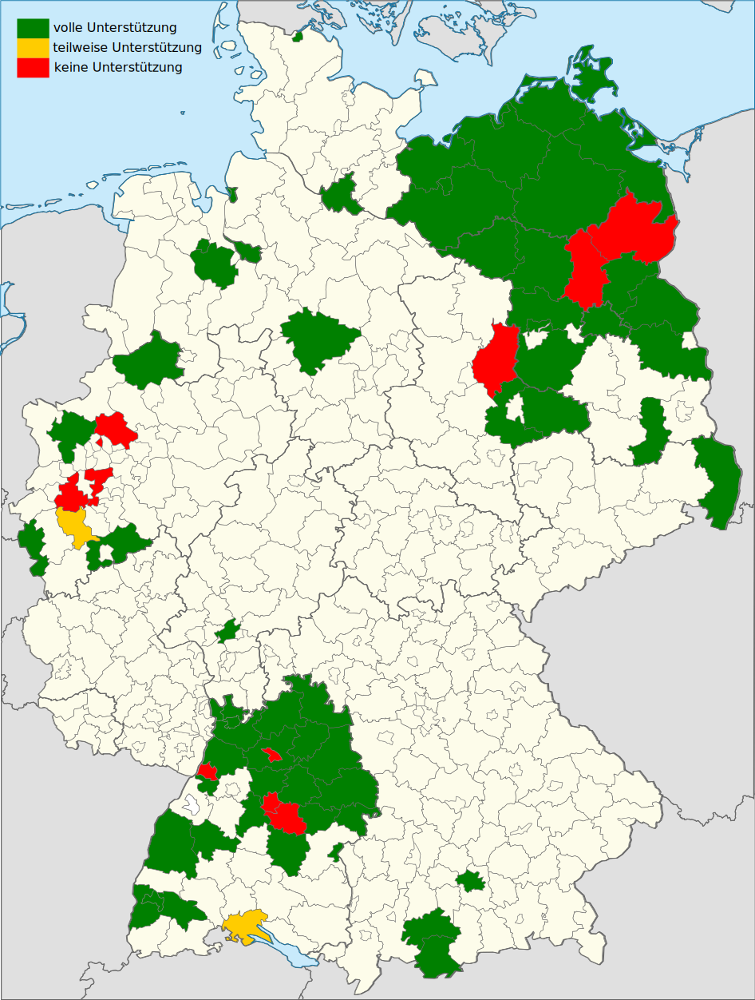

# NextTrash

Ein kleines Kommandozeilen-Tool, das schnell die nächsten Abfuhrtermine anzeigt - nützlich als permanenter Reminder.

Das Tool zieht sich die Daten aus den ICS-Dateien, die viele Abfallwirtschaftsunternehmen auf ihren Webseiten anbieten.

# Getestete Abfallbetriebe

Funktioniert mit 

* ASF Freiburg ([ICS-Generator](https://www.abfallwirtschaft-freiburg.de/de/private_haushalte/abfuhrtermine.php))
* AVL Ludwigsburg ([ICS-Download]())
* AWB Landkreis Göppingen ([ICS-Generator](https://www.awb-gp.de/termine/abfuhrtermine/))
* AWG Bassum ([ICS-Generator](https://www.awg-bassum.de/abfuhrkalender.html))
* AWM München ([ICS-Generator](https://www.awm-muenchen.de/index/abfuhrkalender.html))
* Abfallwirtschaft Breisgau-Hochschwarzwald ([ICS-Download](https://www.breisgau-hochschwarzwald.de/pb/Breisgau-Hochschwarzwald/Start/Service+_+Verwaltung/Abfallwirtschaft.html))
* Abfallwirtschaft Hohenlohekreis ([ICS-Generator](https://www.abfallwirtschaft-hohenlohekreis.de/infos-beratung/termine-leerungen))
* Abfallwirtschaft Ortenaukreis ([ICS-Generator](https://www.abfallwirtschaft-ortenaukreis.de/abfallkalender-abfuhrtermine/abfuhrkalender-strauchgut-und-sperrmuelltermine-2020/))
* Abfallwirtschaft Vorpommern-Rügen ([ICS-Generator](https://www.lk-vr.de/Kreisverwaltung/Abfallwirtschaft/Abfuhrtermine/))
* BSR Berlin ([ICS-Generator](https://www.bsr.de/abfuhrkalender-20520.php))
* Barnimer Dienstleistungsgesellschaft ([ICS-Generator](https://www.kw-bdg-barnim.de/service/abfuhrtermine/entsorgungstermine.html))
* Bremer Stadtreinigung ([ICS-Generator](https://www.die-bremer-stadtreinigung.de/privatkunden/entsorgung/ihr_bremer_abfallkalender-23080))
* Entsorgungsbetrieb Märkisch-Oberland ([https://www.entsorgungsbetrieb-mol.de/de/tourenplan-20192020.html](https://www.entsorgungsbetrieb-mol.de/de/tourenplan-20192020.html))
* Entsorgungsgesellschaft Görlitz-Löbau-Zittau mbH ([ICS-Generator](https://www.abfall-eglz.de/abfallkalender.0.html))
* GOA Ostalbkreis ([ICS-Generator](https://www.goa-online.de/privat/abfuhrkalender/))
* Landkreis Heilbronn ([ICS-Generator](http://www.landkreis-heilbronn.de/abfallkalender.7005.htm))
* Landkreis Ludwigslust-Parchim ([ICS-Generator](https://www.kreis-lup.de/leben-im-landkreis/verkehr-ordnung-sicherheit/abfallwirtschaft/abfallkalender/))
* Landkreis Nordwestmecklenburg ([ICS-Generator](https://www.nordwestmecklenburg.de/de/abfuhrtermine-nwm.html))
* Landkreis Oldenburg ([ICS-Generator](https://www.oldenburg-kreis.de/portal/seiten/abfallkalender-online-900000291-21700.html))
* Landkreis Rostock ([ICS-Generator](https://www.abfall-lro.de/de/abfuhrtermine/index.php/))
* Landkreis Schwäbisch Hall ([ICS-Generator](https://www.lrasha.de/de/buergerservice/abfallwirtschaft/abfallkalender))
* Main-Tauber-Kreis ([ICS-Generator](https://www.main-tauber-kreis.de/Landratsamt/Service/Abfallwirtschaft/Abfallkalender))
* Stadt Oldenburg ([ICS-Generator](https://services.oldenburg.de/index.php?id=45&tx_citkoabfall_abfallkalender[action]=formSimple&tx_citkoabfall_abfallkalender[controller]=Frontend&cHash=6d14b5e4e24d4c9e4dc936e938c81581))
* Stadtentsorgung Rostock ([ICS-iGenerator](https://www.stadtentsorgung-rostock.de/service/ekalend/1216))
* Stadtreinigung Hamburg ([ICS-Generator](https://www.stadtreinigung.hamburg/privatkunden/abfuhrkalender/index.html))
* Stadtwirtschaftliche Dienstleistungen Schwerin ([ICS-Download](https://www.sds-schwerin.de/abfall-strassenreinigung/entsorgungskalender/))
* Ver- und Entsorgungsgesellschaft des Landkreises Vorpommern/Greifswald ([ICS-Generator](https://www.vevg-karlsburg.de/online-abfallkalender-ovp.html))
Landkreis Mecklenburgische Seenplatte ([ICS-Generator](https://www.lk-mecklenburgische-seenplatte.de/Angebote/Abfall-Müll/Abfuhrkalender-2020/index.php))
* ... und vielleicht auch bei Dir. Wenn Deine Abfallbetriebe ICS-Dateien zur Verfügung stellen, informiere mich.

Funktioniert momentan **nicht** mit:

* Landkreis Jerichower Land (kein ICS-Download)
* Stadt Heilbronn (kein ICS-Download)
* Abfallwirtschaft Stuttgart (kein ICS-Download)

## Installation

1. Voraussetzung ist, daß python3 und Make installiert sind
2. ''make''
3. Verschiebe deine ICS-Datei nach ~/.nexttrash/termine.ics
4. Bearbeiter ~/.nexttrash/config.ini und ersetze den String der use_config mit der Config, die für dich passt

## Lizenz

    Copyright (C) 2020 Martin Hohenberg <me@martinhohenberg.de>

    This program is free software: you can redistribute it and/or modify
    it under the terms of the GNU General Public License as published by
    the Free Software Foundation, either version 3 of the License, or
    (at your option) any later version.

    This program is distributed in the hope that it will be useful,
    but WITHOUT ANY WARRANTY; without even the implied warranty of
    MERCHANTABILITY or FITNESS FOR A PARTICULAR PURPOSE.  See the
    GNU General Public License for more details.

    You should have received a copy of the GNU General Public License
    along with this program.  If not, see <http://www.gnu.org/licenses/>.
